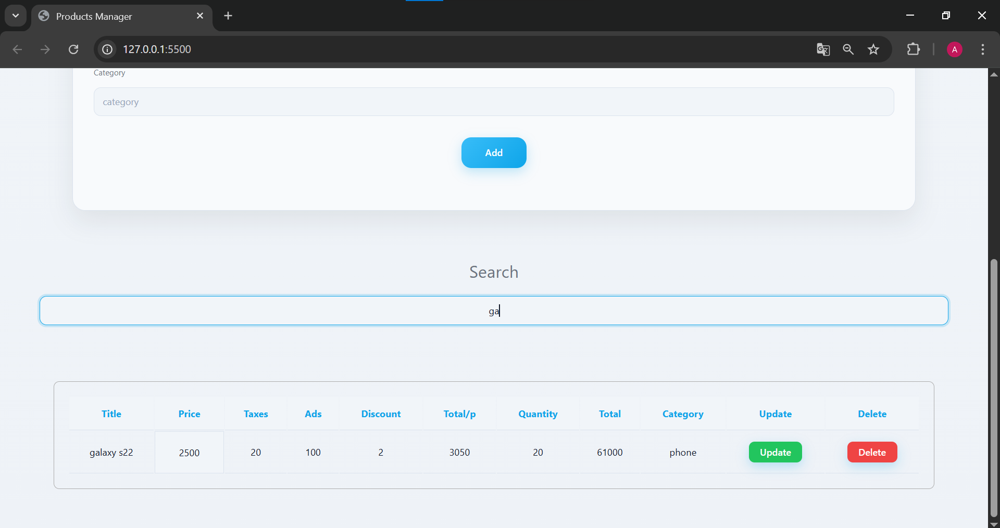

# Product-Management-CRUD

Products Manager is a desktop-focused web application that allows users to manage products with full CRUD functionality.  
You can add, update, delete, and search products while automatically calculating prices based on taxes, ads, discounts, and quantity.

## Features

- Add products with detailed information (price, taxes, ads, discount, quantity, category)
- Live price calculation (per product and total quantity)
- Update existing products
- Delete products
- Search by product title or category
- Data persistence using browser localStorage
- Clean and professional desktop-oriented UI

## Screenshots

### Main Interface

### Product List

### Update Product

### Search Product

## Technologies Used

- HTML5
- CSS3
- JavaScript
- Browser localStorage

## How to Run

1. Clone the repository:

git https://github.com/Adam88791Product-Management-CRUD.git

## Live Demo
here https://697ac52dff9b4d902af26fdb--nimble-donut-dc54cf.netlify.app/
